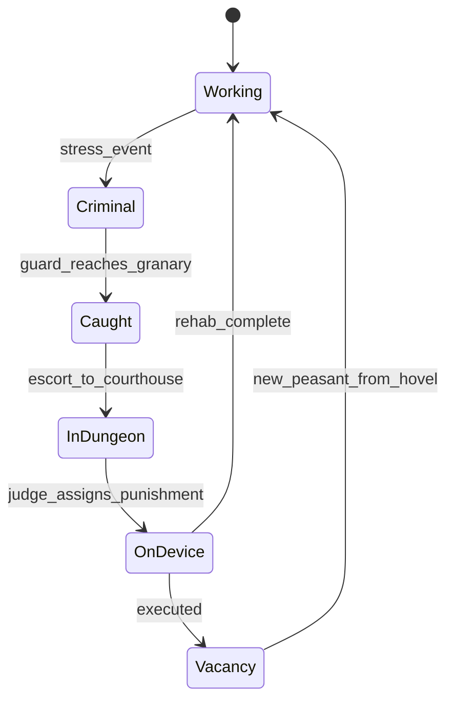

## Relations

- @concepts/stronghold-2-popularity-model.md — −1 pop per active criminal
- @concepts/stronghold-2-economy-storage-chains.md — granary placement heuristic

## Raw Concept

Peasant workers can **turn criminal** under stress. Crime **idles the building** until the worker is caught, tried, and rehabilitated or executed. Punishments trade **time vs honour** and **gold/wood cost**.

## Narrative

### UI signals [CONFIRMED — SH2 Heaven FAQ gameplay]

| Icon | Meaning |
|------|---------|
| Red crossed circle | Building has **no worker** — assign from campfire or build hovels |
| Red circle + **noose** | Worker is **criminal** — building **non-functional** until resolved |

### Minimum crime stack [CONFIRMED]

1. **Guard Post** (20 wood, 1 guard) — patrols, catches criminals
2. **Courthouse** (25 stone, 1 judge) — trial; **dungeon** holds prisoners pre-sentence
3. **Punishment device** — rehabilitation or execution
4. **Torturer's Guild** (10 wood, 100 gold, 2 torturers) — required for **Flogging Post and all severer** devices

**Placement heuristic [CONFIRMED — community walkthrough]:** one Guard Post **adjacent to granary** — criminals **always steal food**, so catches cluster there.

### State machine (clone target)

### Punishment roster [CONFIRMED — cservices3]

Severity order (gentlest → lethal). **Honour +1/month** while device active (fractional-month edge cases below).

| Device | Wood | Gold | Duration | Honour (total) | Torturer? |
|--------|------|------|----------|----------------|-----------|
| Stocks | 5 | 10 | 20 mo rehab | ~20 | No |
| Mask (donkey) | 10 | 10 | 12.5 mo | 12–13 | No |
| Gibbet | 10 | 20 | 15 mo | ~15 | No |
| Wheel | 10 | 50 | 2.5 mo | 2–3 | No |
| Flogging Post | 10 | 80 | 3.5 mo | 3–4 | **Yes** |
| Rack | 10 | 120 | 2 mo | ~2 | Yes |
| Branding Chair | 10 | 150 | 3 mo | ~3 | Yes |
| Burning Post | 200 | 0 | 1 mo **execute** | ~1 | Yes |
| Gallows | 10 | 300 | 0.5 mo execute | 0–1 | Yes |
| Block (beheading) | 10 | 250 | **3 days** execute | 0–1 | Yes |

**Design tradeoff:** gentle punishments are cheap but **idle the building longest**; execution frees the job slot fastest (new peasant from hovel).

### Honour clock quirk [CONFIRMED — cservices3]

Two independent timers per device:

1. **Sentence clock** — starts when prisoner arrives at device
2. **Honour clock** — starts when device is **placed**; awards +1 honour same calendar day each month

If the monthly honour tick falls inside the fractional tail of a short sentence, you may get a **bonus +1**; if after sentence ends, you may **miss** the last +1. Clone can simplify to one clock unless chasing parity.

### Supporting castle services [CONFIRMED — cservices1–2]

| Building | Role | Cost |
|----------|------|------|
| Gong Pit | Removes gong (−1 pop/pile) | 20 wood, 1 worker |
| Falconer's Post | Rat control | 20 wood, 1 worker |
| Apothecary | Disease clouds; heals lord/knights in peace | 20 wood, 200 gold, 1 |
| Well / Water Pot | Fire fighting | 20 / 60 wood |

Gong/rats/disease may be **disabled per mission**.

### Clone phasing

| Phase | Scope |
|-------|-------|
| **C-minimal** | Criminal flag → building idle; guard catch → fixed delay → worker returns |
| **C-full** | Courthouse queue, device picker, torturer gate, honour/month per device |
| **C-QoL** | Auto-assign mildest available punishment; granary-adjacent guard hint in UI |

## Snippets

FAQ one-liner:

> Build Guard Post, Courthouse, and Punishments; severe/fast ones need Torturer's Guild.

## Dead Ends

- **Crime before popularity loop** — criminals only matter once granary + hovels exist
- **Multiple guard posts early** — one by granary suffices per walkthrough wisdom
- **Honour from punishments before courthouse** — devices need trial path
