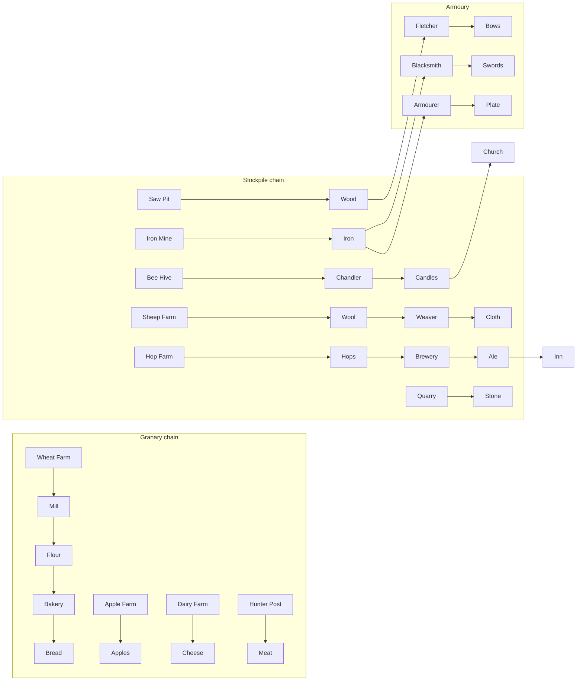

## Relations

- @concepts/stronghold-2-systems-inventory.md — honour/feasts/kingmaker spends
- @entities/projects/castle-sim.md — Tier 2 bread chain already in prototype

## Raw Concept

Four storage buildings anchor logistics: **Stockpile** (12 goods), **Armoury** (8 weapon/armour types), **Granary** (4 peasant foods), **Lord's Kitchen** (4 noble foods + wine). Production is **pull-based**: peasants auto-assign to buildings needing workers.

## Narrative

### Storage buildings [CONFIRMED]

| Building | Holds | Notes |
|----------|-------|-------|
| Stockpile | 12 resource types | 30 sections each; **max 3 stockpiles per estate**, must be **adjacent** |
| Armoury | Weapons + armour | Feeds Barracks equipping |
| Granary | Apples, bread, cheese, meat | Ration + popularity |
| Lord's Kitchen | Eels, geese, pigs, vegetables, wine | Feasts → honour |

Load sizes and section caps vary by good — see tables below.

### Peasant labor rules [CONFIRMED — FAQ gameplay]

- **Campfire cap:** max **24 unemployed** peasants waiting; build jobs or hovels won't spawn more until employed
- **Kingmaker map cap:** total peasants limited by **map size** (hovels may be blocked at cap)
- **Hovel path:** hovels without route to keep (island, cliff, river) **do not supply workers**
- **Hovel capacity:** 8 peasants each (6 wood)
- **Auto-assign:** spare peasants take jobs at buildings with red "no worker" icon

### Stockpile goods [CONFIRMED — resources page]

| Good | Producer | Input | Consumer | Buy | Sell | Load | Max/section |
|------|----------|-------|----------|-----|------|------|-------------|
| Ale | Brewery | Hops | Inn | 15 | 8 | 1 | 16 |
| Candles | Chandler | Bee Hive wax | Church | 8 | 4 | 2 | 16 |
| Cloth | Weaver | Wool | Lady (dance) | 20 | 10 | 1 | 25 |
| Flour | Mill | Wheat | Bakery | 32 | 10 | 1 | 32 |
| Grapes | Vineyard | — | Vintner | 20 | 10 | 1 | 15 |
| Hops | Hop Farm | — | Brewery | 15 | 8 | 2 | 16 |
| Iron | Iron Mine + Ox | Ore tile | Smith, Armourer | 45 | 25 | 8 | 36 |
| Pitch | Pitch Rig | Marsh | Pitch ditches | 16 | 8 | 2 | 16 |
| Stone | Quarry + Ox | Stone tile | Construction | 4 | 2 | 16 | 95 |
| Wheat | Wheat Farm | — | Mill | 23 | 8 | 2 | 32 |
| Wood | Saw Pit | Trees | Many buildings | 3 | 1 | 16 | 36 |
| Wool | Sheep Farm | Sheep | Weaver | 15 | 8 | 1 | 16 |

**Ox Tether:** hauls stone/iron to stockpile; more tethers needed as haul distance grows (5 wood, 1 worker).

### Granary food [CONFIRMED]

| Food | Producer | Load | Buy/Sell |
|------|----------|------|----------|
| Apples | Apple Farm | 5 | 8 / 4 |
| Bread | Bakery ← Mill ← Wheat | 16 | 8 / 4 |
| Cheese | Dairy Farm | 6 | 8 / 4 |
| Meat | Hunter's Post | 1 | 8 / 4 |

### Lord's Kitchen (noble) [CONFIRMED]

| Item | Producer | Load | Buy/Sell |
|------|----------|------|----------|
| Eels, Geese | Fish Farm | 1 each | 12 / 6 |
| Pigs | Pig Farm | 1 | 12 / 6 |
| Vegetables | Gardener's Hut | 1 | 12 / 6 |
| Wine | Vintner | Grapes | 1 | 24 / 12 |

### Armoury [CONFIRMED]

| Item | Workshop | Input | Unit |
|------|----------|-------|------|
| Bows / Crossbows | Fletcher | Wood | Archer / Crossbowman |
| Spears / Pikes | Poleturner | Wood | Spearman / Pikeman |
| Maces / Swords | Blacksmith | Iron | Maceman / Swordsman, Knight |
| Leather Armour | Tanner | Cow (Dairy) | Crossbowman, Maceman |
| Plate Armour | Armourer | Iron | Swordsman, Knight |

Workshops typically **10–20 wood + 100–200 gold + 1 worker**; deliver finished goods to Armoury.

### Production graph (summary)

### Market & carts [CONFIRMED]

- **Market:** buy/sell per mission restrictions; prices from tables above
- **Carter Post:** moves goods between estates/castles (stockpile/armoury/granary endpoints)

### castle-sim mapping [TENTATIVE]

| SH2 chain | castle-sim status (2026-06-13) |
|-----------|--------------------------------|
| Wood / stone | Tier 1–2 ✓ |
| Wheat → bread | Tier 2 ✓ |
| Meat (hunter) | story-011 planned |
| Ale / church / lord kitchen | Phase C |
| Weapons → armoury | Phase D |

## Snippets

Saw Pit delivers **16 wood per cart load**; iron ore **8 per load**.

## Dead Ends

- **Fourth stockpile** — hard cap 3 per estate
- **Tanner without dairy** — needs live cow from Dairy Farm
