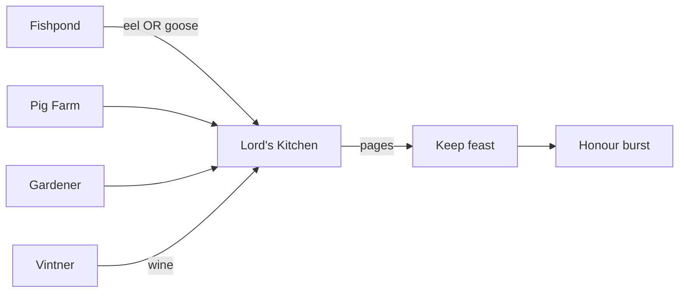

## Relations

- @concepts/stronghold-2-economy-storage-chains.md — stockpile caps + market prices
- @sources/sh2-heaven-resources-luxury-deep-read-2026-06-19.md — Heaven scrape (2026-06-19)

## Raw Concept

**Phase C** reference: noble food → Lord's Kitchen → feasts; parallel **ale/inn** and **cloth/Lady** honour loops. Distinct from granary peasant food.

## Narrative

### Lord's Kitchen pipeline [CONFIRMED]



| Input | Producer | Yield/load |
|-------|----------|------------|
| Eels / geese | Fishpond (10w) | 1 unit, **alternating** |
| Pigs | Pig farm (20w) | 1 |
| Vegetables | Gardener (20w) | 1 |
| Wine | Vineyard → vintner | 1 |

**Lord's Kitchen:** 10 stone, **4 workers** (cook + assistants; pages carry to keep).

### Feast honour [CONFIRMED]

```
honour = (4 × guests × food_types_present) + 10
+ 10 if Musicians Guild active
```

| Keep size | Max guests (Heaven) |
|-----------|---------------------|
| Large | 9 |

**Max theoretical:** 5 types × 9 guests × 4 + 10 + 10 musician = **200** (Heaven cites 190 base + 10 musician — align at 9 guests × 5 types).

**UI:** Kitchen panel shows per-type stock, guest count, **preview honour** for next feast.

**castle-sim:** Phase C `FeastService` — don't require manual spreadsheet; show preview like retail.

### Ale vs production [CONFIRMED]

```
Hop farm → Brewery → Stockpile → Inn (100w)
```

| Ale level | Pop Δ/mo | Side effect |
|-----------|----------|-------------|
| Double | +8 | Workers **idle drunk** — industry slows |

Kingmaker automation often maxes ale + double rations + cruel tax — see @concepts/stronghold-2-kingmaker-strategy.md. Clone must model **worker efficiency hit**, not pop only.

### Lady / cloth honour [CONFIRMED]

```
Sheep → Weaver → Stockpile (cloth)
Page from Lord's Kitchen → Lady's Bedchamber (1 cloth/dress)
4 dresses → Dance → +200 honour (one-shot; reset cycle)
```

Competes with **market sell** on cloth — Kingmaker guides sell excess luxury; dances are honour bursts for rank pushes.

### Candles / church (adjacent luxury) [CONFIRMED]

Beehive (0 workers) → Chandler (2 candles/load) → stockpile → church mass tiers (+2..+8 pop/mo).

### Estates caveat [CONFIRMED — prior ingest]

Royal chains on **secondary estates** need **Lord's Kitchen on that estate** to feast locally; carter manual for wine/luxury — @concepts/stronghold-2-estates-system.md.

### castle-sim phase map

| System | Phase | Data stub |
|--------|-------|-----------|
| Lord's Kitchen storage | C | `data/sh2/luxury_goods.json` (TBD) |
| Feast honour calc | C | mirror formula + keep guest cap |
| Inn ale + worker debuff | C | link PopularityService + LaborDirector |
| Lady dance | C+ | after bedchamber + weaver |
| Market sell luxury | B/C | prices from economy doc |

## Dead Ends

- **Ducks** on Heaven honour page — use fishpond eel/geese; ignore duck asset unless retail proves otherwise
- Cloning **190 honour feast spam** without food chain cost — honour must respect kitchen stock + rank pacing
